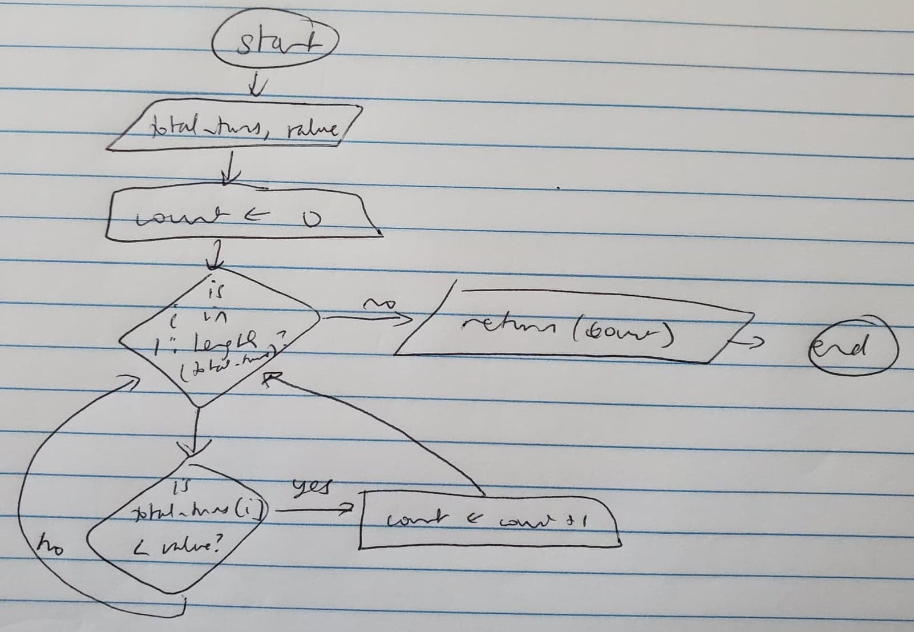

```{r setup, include=FALSE}
knitr::opts_chunk$set(echo = TRUE)
```

```{r, code= readLines("604745507_stats102a_hw2.R")}

```
I. Flowcharts and Pseudocode of Functions:

  i. show_board()

```
  INPUT: a board object
  OUTPUT: a visual representation of a board
  plot the board on an x, y field with the number of rows and columns as x and y
  add a grid to the board
  a. 
  set the number of iterations to the length of the board/2
  set count equal to 1
  while the number of iterations isn't yet zero
    set x to 0, y to 0
    if value in the list of chutes is less than its follower
      set x to its follower and y to it
    otherwise
      set y to its follower and x to it
    set x1 to the remainder of x/number of columns
    set y1 to the integer value of x/number of columns
    set x2 to the remainder of y/number of columns
    set y2 to the integer value of y/number of columns
    add a red arrow at x1,y1 to x2,y2
    increment the count and number of iterations
  b. 
  repeat steps a through b for the ladders, but make them green and pointing upwards
```

 
  
  ii. play_c1()

```
  INPUT: board, number of players, and spinner
  OUTPUT: a list: list(winner, turns, chutes, ladders, turns_done, is_close, sixth_turn, total_turns)
  
  if less than 1 player
    return and exit
  make the spinner_vector 1 through the number input, unless a vector was given
  create board_vector from make_list_from_board
  set winner to 0, sixth_turn, everyones_place, turns, chutes, ladders to a vector of 0s, is_close to FALSE, winner_found to FALSE
  while everyones_finished is false
    for each player
      set the new location to the current plus the spinner value, if it isn't over the max
      check if this is the 6th turn, and if so, record it
    if the board_vector at the current place isn't 0 (meaning there's a chute or ladder there)
      set the value_to_match to the current spot
      see if it's divisible by 2, representing a ladder
        if it is, then set the new value of everyones_place[i] to the top of the ladder
        else it isn't, then set the new value of everyones_place[i] to the bottom of the chute
     if everyones_place[i] is the length of the board vector
      everyones_status[i] is true
    if (winner_found is false)
        set winner to i
        set winner_found to true
        check to see if it was close by looping through the players positions + the length of the spinner
      if everyones_status is all true, then set everyones_finished to true
  set turns_done and total_turns to 0
  loop through players and see if the turns are larger than turns_done, and isolate the largest number of turns
  add all the turns to have the value of total_turns
  create a list of everything to return: list(winner, turns, chutes, ladders, turns_done, is_close, sixth_turn, total_turns)
  return the list
```


  
  iii. make_random_board()
  
```
  INPUT: number of rows, columns, chutes, and ladders
  OUTPUT: a random board
  
  set the number of tiles to the number of rows * number of columns
  if the number of chutes and ladders is greater than the number of tiles - 2 divided by two
    return "please input a valid number of chutes and ladders"
  set the board_vector to number of tiles 0
  a.
  create a chutes_vector, set count to 0
  while count isn't equal to number of chutes*2
    set current to a random value from 2 to the second to last tile
    if the current tile, previous tile, and next tile aren't 0 
      add a 1 to the spot of board_vector[current]
      add current to the chutes_vector
      increment count
  b. 
  repeat steps a through b for the ladders vector
  create a list of the number of rows, number of columns, chutes vector, and ladders vector
  return the list
```

 
  
  iv. make_list_from_board()

```
  INPUT: a board representation
  OUTPUT: a vector representation of the board
  
  create a board vector that is the number of tiles 0s
  a.
  start at 1, set the number of iterations for chutes equal to the length of the third list in the board representation/2
  set start_chutes to 1
  for each value in 1 through number of iterations for chutes
    set the place in the board vector equal to a value in the third list of the board to the start_number
    set the second place in the board vector equal to a value after the one previously to the start_number
    increment the start_number and start_chutes by 2
  b.
  Repeat steps a through b, except use the fourth list in the board representation and set start_number to 2
 
```


  
  v. simulate_game_10000_times()

```
  INPUT: seed, board, number of players, spinner
  OUTPUT: a list of the answers (or help for the answers) to questions 1 through 6
  
  set the seed to seed
  set count to 10000, ans1 to 10000, ans2 to a list of nplayers 0s
  set helper_3 to a numeric vector, ans3 through ans5 to 0, helper_6 to a numeric vector, ans6 to 0
  set total_turns_needed to a numeric vector
  while count isn't 0
    set results to play_c1(board, nplayers, spinner)
    add results[[8]] to total_turns_needed 
    if results[[5]] < ans1
      set ans1 to results[[5]]
    if results[[5]] > ans5
      set ans5 to results[[5]]
    if results[[6]] is true
      increment ans4
    add results[[5]] to helper_3
    for each player in nplayers
      add results[[7]][i] to helper_6
    increment ans2[results[[1]]]
    decrement count
  for each i in 1 through length(helper_3)
    if helper_3[i] equals ans1
      increment ans3
  set ans6 to getMode(helper_6)
  create a list of answers 1 through 6
  plot total_turns_needed
  return the list

```


  
  vi. question5()

```
  INPUT: total turns vector, value to match to
  OUTPUT: numeric value out of 10000
  set count to 0
  for each i in 1 through length of the input vector
    if vector[i] < value
      increment count
  return the count
```
  


  vii. getMode()
  
```
  INPUT: a vector x
  OUTPUT: the mode of the function
  set ux to unique(x)
  return the max of the tabulations of matches between x and ux, i.e. the mode
```


II. Questions- Standard Game

```{r}
  show_board(default_board)
```
  
  The above is a representation of the default board.

  i. 10,000 simulations of one-player games, random seed is UID

```{r}
  q1a <- simulate_game_10000_times(604745507, default_board, 1, 6)
  print(q1a)
```

    a. Minimum number of turns needed to win the game was 7.
    b. 100% of the games were won by the player.
    c. 0.0016% of the games ended in the minimum number possible.
    d. 0 games were close.
    e. The maximum number of turns needed to finish the game is 250.
    f. The most likely square for a player to be on at the end of the 6th turn is 21.
    
  
  ii. 10,000 simulations of two-player games, random seed is UID in reverse
  
```{r}
  q1b <- simulate_game_10000_times(705547406, default_board, 2, 6)
  print(q1b)
```
  
    a. Minimum number of turns needed to win the game was 8.
    b. 50.13% of games were won by player 1, 49.87% of games were won by player 2.
    c. 0.0001% of games ended in the minimum number possible.
    d. 27.43% of games were close.
    e. The maximum number of turns needed to finish the game is 253.
    f. The most likely square for a player to be on at the end of the 6th turn is 21.
    
  iii. 10,000 simulations of three-player games, random seed is sample(1e4, 1)
  
```{r}
  q1c <- simulate_game_10000_times(sample(1e4, 1), default_board, 3, 6)
  print(q1c)
```
  
    a. Minimum number of turns needed to win the game was 12.
    b. 33.88% games were won by player 1, 33.57% games by player 2, and 32.55% by player 3.
    c. 0.0002% of games ended in the minimum number possible.
    d. 43.60% of games were close.
    e. The maximum number of turns needed to finish the game is 246.
    f. The most likely square for a player to be on at the end of the 6th turn is 21.  

  iv. Question 5: What proportion of three-player games ended in fewer total turns than the observed    maximum number of turns for one-player game?
  
  I found that 99.08% of three-player games ended in fewer total turns, by running question5(q1c[[7]], q1a[[5]])/10000.

III. Questions- Custom Game

```{r}
  random_board <- make_random_board(11, 13, 13, 11)
  show_board(random_board)
```
  
  The above is a representation of the random board I will be using for the remaining questions.

  i. 10,000 simulations of one-player games, random seed is UID
  
```{r}
  q2a <- simulate_game_10000_times(604745507, random_board, 1, 6)
  print(q2a)
```
  
    a. Minimum number of turns needed to win the game was 6.
    b. 100% of the games were won by the player.
    c. 0.0005% of the games ended in the minimum number possible.
    d. 0 games were close.
    e. The maximum number of turns needed to finish the game is 956.
    f. The most likely square for a player to be on at the end of the 6th turn is 23.
    
  ii. 10,000 simulations of two-player games, random seed is UID in reverse
 
```{r} 
  q2b <- simulate_game_10000_times(705547406, random_board, 2, 6)
  print(q2b)
```
  
    a. Minimum number of turns needed to win the game was 9.
    b. 50.01% of games were won by player 1, 49.99% of games were won by player 2.
    c. 0.0001% of games ended in the minimum number possible.
    d. 16.18% of games were close.
    e. The maximum number of turns needed to finish the game is 1082.
    f. The most likely square for a player to be on at the end of the 6th turn is 23.
    
  iii. 10,000 simulations of three-player games, random seed is sample(1e4, 1)
  
```{r}
  q2c <- simulate_game_10000_times(sample(1e4, 1), random_board, 3, 6)
  print(q2c)
```
  
    a. Minimum number of turns needed to win the game was 9.
    b. 33.19% of games were won by player 1, 34.30% of games by player 2, and 32.51% by player 3.
    c. 0.0001% of games ended in the minimum number possible.
    d. 29.11% of games were close.
    e. The maximum number of turns needed to finish the game is 1293.
    f. The most likely square for a player to be on at the end of the 6th turn is 23.

  iv. Question 5: What proportion of three-player games ended in fewer total turns than the observed    maximum     number of turns for one-player game?
  
  I found that 99.66% of three-player games ended in fewer total turns, by running question5(q2c[[7]], q2a[[5]])/10000.


